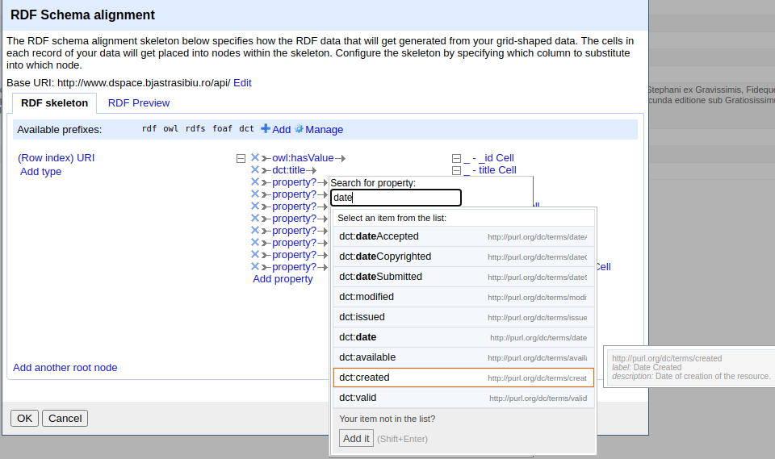

# Extract, transform load

## Catmandu

Comanda `catmandu` a fost gândită pentru a procesa informație structurată. Pentru o introducere completă, vezi https://librecatproject.wordpress.com/2014/12/08/day-6-introduction-into-catmandu/.

Pentru a genera un JSON din setul de date în format XML (MARC21):

```bash
sudo catmandu convert -v MARC --type XML to JSON < MARC_Export_1628503088997.xml > test.json
```

Vezi un exemplu aici: https://librecatproject.wordpress.com/tag/catmandu/

Exploatează documentația de aici: https://librecatproject.wordpress.com/2014/12/11/day-9-processing-marc-with-catmandu/

### Fix language

Pentru regulile de mapping, ai la îndemână: https://github.com/LibreCat/Catmandu-MARC/wiki/Mapping-rules

La comanda `convert` poți adăuga opțiunea `--fix` cu ajutorul căreia poți modela cum apar datele în rezultat. Un exemplu pe care documentația îl oferă este: `catmandu convert JSON --fix 'retain_field(main); retain_field(main.temp)' to YAML < weather.json`.

Pentru că de cele mai multe ori este necesar să creezi mai multe etape de modelare a câte unui fragment din înregistrare, poți crea un fișier pe care să-l intitulezi arbitrar `modelare.fix`, unde să pui toate regulile.

```bash
nano bjsibiumostra.fix
```

Conținutul poate fi similar cu următoarele linii:

```text
retain_field(main)
retain_field(main.temp)
```

Apoi, când execuți comanda `convert`, opțiunii `--fix` îi poți pasa fișierul în care sunt toate regulile. Aceste reguli despre care vorbim sunt metode care se aplică fiecărui element. Un element (*item*) în Catmandu este o înregistrare, o linie de CSV sau un rând de Excel, etc. Pentru a avea o perspectivă asupra modului în care pot fi utilizate aceste reguli, vă invit să consultați documentația de la http://librecat.org/Catmandu/#fix-language. Alternativ, poți consulta acest link: https://github.com/LibreCat/Catmandu/wiki/Fix-language.

Ori de câte ori ai nevoie să modifici setul de reguli, poți edita fișierul și apoi rulezi din nou comanda.

Pentru o referință la câmpurile MARC21: https://www.loc.gov/marc/bibliographic/

Convertim o înregistrare MARC21 în JSON.

```bash
sudo catmandu convert -v MARC --fix bjsmostra.fix --type XML to JSON < MARC_Export_1628503088997.xml > dublincore.json
```

## Citire și prelucrare JSON cu jq

O posibilă etapă intermediară este explorarea setului de date cu scopul de a realiza potențialul pe care anumte informații le oferă, fie că vorbim de afișare, fie de prelucrare ulterioară.

Pentru a instala *jq* pe propriul computer, pentru Windows, urmați ghidul video [Install jq on windows | json parser](https://www.youtube.com/watch?v=rrjIVepRqPI).

### Citirea fișierului

Dacă dorești să parcurgi fișierul fără a face vreo transformare, folosești sintaxa punct care indică întregul conținut.

```bash
cat dublincore.json | jq '.' | less -+S
```

În cazul în care dorești să prelucrezi înregistrare cu înregistrare, adică obiect cu obiect dintr-un array, vei folosi sintaxa `.[]`. În interiorul parantezelor pătrate este permisă introducerea unui interval de înregistrări delinitat de indexul de start și cel de final. Este permisă introducerea fie și a unei singure limite, ceea ce va conduce la selectarea tuturor înregistrărilor până la indexul menționat după `:` (`[:10]`, de la indexul 0, până la 10) sau de la indexul de dinainte până la final (`[10:]`, de la indexul 10 până la final).

Dacă folosești această notație pe obiecte, vor fi produse rând pe rând toate valorile obiectului.

#### Filtrarea după câmpuri

Expresiile care sunt introduse în `jq` între ghilimele simple, se numesc filtre. Pot fi introduse mai multe filtre pentru același input generat din extragerea unui singur obiect, folosind `.[]`. Rezultatul acestor filtre vor fi concatenate în ordinea producerii lor. De exemplu, filtrul `.ceva, altceva` va avea drept rezultat valorile primului câmp urmat de producerea valorii din cel de-al doilea. În cazul în care unul din câmpuri este la rândul său un array, se va redacta scriind numele câmpului urmat de `[]`, precum în `.numeCamp[]`. Reține faptul că în cazul în care ai mai multe componente de filtrare, toate vor produce rezultate produse separat, iar în cazul unui câmp array, vor fi extrase valorile fiecărui element.

Să luăm drept exemplu următoarea înregistrare. Pentru a experimenta, vom folosi instrumentul de modelare și explorare pus la dispoziție de producătorii `jq`, accesibil de la următorul link https://jqplay.org/#.

```json
{
  "identifier": "094.1(498); 811.135.1'36-112",
  "_id": null,
  "date": "1805",
  "format": "110 p. ; 19 cm",
  "publisher": "Typis Regiae Universitatis Pestanae",
  "subject": ["carte românească veche", "lingvistică", "limba română", "gramatică", "gramatică istorică", "morfologie"],
  "creator": ["Şincai, Gheorghe"],
  "title": "Elementa Linguae Daco - Romanae sive Valachicae emendata, facilitata, et in meliorem ordinem redacta per Georgium Sinkay de Eadem, AA. LL. Philosophiae, & SS. Theologiae Doctorem, Scholarum Nationalium Valachicarum in Magno Transylvaniae Principatu primum, atque emeritum Directorem, nunc penes Regiam Universitatis Pestanae Typographiam Typi Correctorem. Budae, Typis Regiae Universitatis Pestanae. 1805. Georgium Sinkai [Carte tipărită]",
  "description": "Colecţii Speciale - BRV BRV101 687a BRV BRV101"
}
```

Pentru a genera un rezultat care să afișeze prima dată valoarea câmpului `identifier`, a câmpului `publisher` urmate de toate elementele array-ului `subject` vom proceda la construirea următorului filtru: `.identifier, .publisher, .subject[]`. Rezultatul va fi următorul.

```text
"094.1(498); 811.135.1'36-112"
"Typis Regiae Universitatis Pestanae"
"carte românească veche"
"lingvistică"
"limba română"
"gramatică"
"gramatică istorică"
"morfologie"
```

##### Operatorul pipe

Acest operator combină două filtre prin faptul că rezultatul primului este materialul de input al celui din dreapta. Dacă expresia din stânga produce mai multe rezultate, expresia din dreapta va rula individual pentru fiecare dintre acestea.

Un exemplu simplu ar fi extragerea valorii unui câmp a unei înregistrări când avem mai multe într-un array. Să luăm drept exemplu un array care are drept elemente două înregistrări.

```json
[{
  "identifier": "094.1(498); 811.135.1'36-112",
  "_id": null,
  "date": "1805",
  "format": "110 p. ; 19 cm",
  "publisher": "Typis Regiae Universitatis Pestanae",
  "subject": ["carte românească veche", "lingvistică", "limba română", "gramatică", "gramatică istorică", "morfologie"],
  "creator": ["Şincai, Gheorghe"],
  "title": "Elementa Linguae Daco - Romanae sive Valachicae emendata, facilitata, et in meliorem ordinem redacta per Georgium Sinkay de Eadem, AA. LL. Philosophiae, & SS. Theologiae Doctorem, Scholarum Nationalium Valachicarum in Magno Transylvaniae Principatu primum, atque emeritum Directorem, nunc penes Regiam Universitatis Pestanae Typographiam Typi Correctorem. Budae, Typis Regiae Universitatis Pestanae. 1805. Georgium Sinkai [Carte tipărită]",
  "description": "Colecţii Speciale - BRV BRV101 687a BRV BRV101"
}, {
  "date": "1737",
  "format": "[8] p., 48 p. ; 23 cm",
  "_id": null,
  "identifier": "271.3(094)(498.4); 094.1(498.4)",
  "description": "Colecţii Speciale - Transilvanice T00156 448 T1 T00156",
  "title": "Ortus, Progressus, Vicissitudines, Excisio, et Restauratio, olim custodiae, nunc ab anno M. DCC. XXIX. Provinciae Transylvaniae Ord. Min. S. P. N. Francisci Strict Observ. Tituli S. Regis Stephani ex Gravissimis, Fideque dignis Authoritatibus clara, ac succinta methodo compilatus, primum in Urbe Orbis capite revisus, castigatus, approbatus, et excusus Typis Reverendae Camerae Apostolicae. eX Vrbe septICoLLe ReDVX oMIne FaVsto Hac secunda editione sub Gratiosissimus auspiciis [...] domini Joannis Haller ... [Györffi Pál] ; Editor: Joannis Haller [Carte tipărită]",
  "creator": ["Györffi Pal"],
  "subject": ["istoria Transilvaniei", "Transilvanice", "ordine călugăreşti", "franciscani", "biserica catolica", "ordine religioase"],
  "publisher": "Typis Ven. Conventus Csikiensis"
}
]
```

Pentru acestea două înregistrări, vom dori să extragem doar titlurile și vom pasa lui jq următorul fitru `.[] | .title`

```text
"Elementa Linguae Daco - Romanae sive Valachicae emendata, facilitata, et in meliorem ordinem redacta per Georgium Sinkay de Eadem, AA. LL. Philosophiae, & SS. Theologiae Doctorem, Scholarum Nationalium Valachicarum in Magno Transylvaniae Principatu primum, atque emeritum Directorem, nunc penes Regiam Universitatis Pestanae Typographiam Typi Correctorem. Budae, Typis Regiae Universitatis Pestanae. 1805. Georgium Sinkai [Carte tipărită]"
"Ortus, Progressus, Vicissitudines, Excisio, et Restauratio, olim custodiae, nunc ab anno M. DCC. XXIX. Provinciae Transylvaniae Ord. Min. S. P. N. Francisci Strict Observ. Tituli S. Regis Stephani ex Gravissimis, Fideque dignis Authoritatibus clara, ac succinta methodo compilatus, primum in Urbe Orbis capite revisus, castigatus, approbatus, et excusus Typis Reverendae Camerae Apostolicae. eX Vrbe septICoLLe ReDVX oMIne FaVsto Hac secunda editione sub Gratiosissimus auspiciis [...] domini Joannis Haller ... [Györffi Pál] ; Editor: Joannis Haller [Carte tipărită]"
```

### Filtrări cu jq

Materiale de instruire: https://stedolan.github.io/jq/tutorial/

Vom alege prima înregistrare: `cat dublincore.json | jq '.[0]' | less -+S`.

Să extragem titlul primei înregistrări. Pentru a face acest lucru, vom pune la filtru (expresia de după pipe) un punct urmat de numele câmpului așa cum este el în înregistrare.

```bash
cat dublincore.json | jq '.[0] | .title' | less -+S
```

Când dorești să faci o filtrare într-o plajă de înregistrări, vei menționa plaja delimitată de indexul de pornire și cel de final.

```bash
cat dublincore.json | jq '.[0:3]' | less -+S
```

În exemplul de mai sus, vom prelucra primele patru înregistrări. Adică de la indexul 0, la indexul 3.

Să extragem mai multe câmpuri ale înregistrării. Pentru a face aceasta, vom adăga numele câmpului precedat de punct separat de câmpul anterior prin virgulă.

```bash
cat dublincore.json | jq '.[0] | .title, .publisher' | less -+S
```

Dacă avem nevoie să reformatăm datele pe care le extragem, vom introduce în filtru un obiect în care vom redenumi numele câmpului de date.

```bash
cat dublincore.json | jq '.[] | {titlu: .title}' | less -+S
```

Dacă dorești rezultatul să fie afișat ca un array de rezultate, îmbraci toată expresia între paranteze.

```bash
cat dublincore.json | jq '[.[] | {titlu: .title}]' | less -+S
```

#### Extragere de câmpuri pentru afișare

Pentru a extrage câmpurile necesare pentru a fi afișate, le vom menționa ca filtru.

```bash
cat dublincore.json | jq '.[0] | {titlu: .title}' | less -+S
```

### Extragere cu reformatare prin mapping

În cazul în care dorești să extragi date pe care să le reformatezi într-o structură de date nouă, trebuie să croiești filtrele de așa natură cât să includă o funcție de `map` a cărui rol este să parcurg structura fiecărui element din array-ul original și să-i aplice filtrele care urmează în înșiruirea de pipe.

```bash
cat dublincore.json | jq '.[:3] | [map(.) | .[] | {titlu: .title, autor: .creator[]}]' | less -+S
```

Ca aplicație practică, vom reformata două câmpuri, care sunt sub forma unor array-uri, dar care ne-ar servi mai bine drept text. În imagine se observă rapid o mică problemă.


Câmpul `subject` și `creator` sunt array-uri. Dacă vor fi lăsate așa, vor produce mai departe probleme în OpenRefine, unde vom dori să îmbogățim datele.


Din imagine se observă faptul că elementele array-ului `subject` s-au constituit în înregistrări separate la import. Pentru a evita astfel de posibile probleme, vom rearanja datele ca șir de caractere, fiecare element din array-ul existent va fi separat prin virgulă de celelalte. Pentru început, să explorăm cum ar fi posibil să realizăm un așa-numit `join` al datelor din array-uri.

```bash
cat dublincore.json | jq '.[] | (.creator | join(", ")), (.subject | join(", "))' | less -+S
```

Ceea ce am avea nevoie la final ar fi un obiect / înregistrare reformatat astfel încât câmpurile `creator` și `subject`, care sunt array-uri să fie valori text care cuprind fostele elemente dar separate prin virgule.


```bash
cat dublincore.json | jq '.[:10] | map(.) | .[] | {_id, identifier, creator: (if has("creator") then (.creator | join(", ")) else .creator = "" end) , subject: (if has("subject") then (.subject | join(", ")) else .subject = "" end), date, publisher, title, description, format}' | less -+S
```

Rezultatul este satisfăcător, dar nu suficient pentru că aplicând această transformare tuturor datelor setului, am putea da peste înregistrări care nu au câmpurile vizate și aceste situații nasc erori. Ideal ar fi să avem o soluție care să producă înregistrări curate, precum cea din ilustrația de mai jos.


Vor trebui tratate cazurile în care câmpul nu există în înregistrarea originală și cele în care valoarea este `null`.

```bash
cat dublincore.json | jq '
.[] |
{
  _id: (if ._id == null then "" else ._id end),
  creator: (if has("creator") then .creator | join(", ") else .creator // "" end),
  subject: (if has("subject") then .subject | join(", ") else .subject // "" end),
  title,
  publisher: (if .publisher == null then "" else .publisher end),
  identifier: (if .identifier == null then "" else .identifier end),
  date, format,
  description: (if .description == null then "" else .description end)
}' | less -+S
```

Pentru cei care vor să consulte live prelucrarea setului de date, acesta este disponibil la adresa https://jqplay.org/s/gnn2-h4syz.

#### Salvare rezultat

În cazul în care dorești salvarea rezultatului într-un nou fișier, la final, în loc să trimiți lui `less`, vei face o salvare în fișier: `> 'numeFisier.json'`, de exemplu.

Vom proceda la salvarea într-un nou fișier numit `dcreformated.json`.

```bash
cat dublincore.json | jq '
[.[] |
{
  id: (if ._id == null then "" else ._id end),
  creator: (if has("creator") then .creator | join(", ") else .creator // "" end),
  subject: (if has("subject") then .subject | join(", ") else .subject // "" end),
  title,
  publisher: (if .publisher == null then "" else .publisher end),
  identifier: (if .identifier == null then "" else .identifier end),
  date, format,
  description: (if .description == null then "" else .description end)
} | del(._id)
]' > 'dcreformated.json'
```

sau folosind `map()`:

```bash
cat dublincore.json | jq '
map(. +
{
  id: (if ._id == null then "" else ._id end),
  creator: (if has("creator") then .creator | join(", ") else .creator // "" end),
  subject: (if has("subject") then .subject | join(", ") else .subject // "" end),
  title,
  publisher: (if .publisher == null then "" else .publisher end),
  identifier: (if .identifier == null then "" else .identifier end),
  date, format,
  description: (if .description == null then "" else .description end),
} | del(._id))' > 'dcreformated.json'
```

Vei obține un rezultat similar cu următoarea captură.


### Căutarea unui fragment de text

Uneori ai nevoie să cauți un anumit fragment de text într-un anume câmp. În exemplul de mai jos vom căuta o înregistrare care are la creator fragmentul de text `Șincai`.

```bash
cat dublincore.json | jq '.[] | select(.creator[]|test("^Şincai."))' | less -+S
```

#### Ștergerea unui element

În cazul în care ai nevoie să ștergi un element, poți aplica un filtru `del`. În următorul exemplu, vom face un filtru care mai întâi să extragă primele două înregistrări din care să fie eliminat câmpul `creator`.

```bash
cat dublincore.json | jq 'del(.[].creator)' | less -+S
```

## Introducerea datelor în MongoDB

Vom folosi din nou utilitarul `catmandu` pentru a crea o bază de date MongoDB.

```bash
catmandu import -v JSON --multiline 1 to MongoDB --database_name catalogcolectiv --bag carti < dcreformated.json
```

Se va crea o bază similar capturii făcute din MongoDB Compass.


Odată importat în MongoDB, putem exporta în alte formate la nevoie, folosind utilitarul `catmandu`.

```bash
catmandu export MongoDB --database_name catalogcolectiv --bag carti to YAML --file dumpcatalog.yaml
```

În scopul preluării ulterioare a datelor în OpenRefine pentru a fi îmbogățite, vom exporta din baza de date ca fișier JSON. Acest pas este necesar pentru a ne asigura că pentru câmpul `_id` avem informație.

```bash
catmandu export MongoDB --database_name catalogcolectiv --bag carti to JSON --file dumpcatalog.json
```

Având baza de date populată, folosind utilitarul `catmandu` putem să inițiem chiar căutări:

```bash
catmandu count MongoDB --database_name catalogcolectiv --bag carti --query '{"title": {"$regex":"^Elementa Linguae Daco - Romanae sive Valachicae"}}'
```

Va fi indicat faptul că există o înregistrare, iar dacă se dorește, se poate constitui un fișier după criteriile de căutare.

```bash
catmandu count MongoDB --database_name catalogcolectiv --bag carti --query '{"title": {"$regex":"^Elementa Linguae Daco - Romanae sive Valachicae"}}' to CSV -file toCSV.csv
```

## Îmbogățire cu OpenRefine

OpenRefine este un pachet software care este utilizat pentru a curăța date imperfecte. Acesta poate fi descărcat de la următorul link: https://openrefine.org/. Ceea ce ne ajută în cazul exercițiului nostru de transformare este faptul că permite îmbogățirea datelor prin așa-numita „reconciliere”.

Primul pas este să creăm un nou proiect.


Vom folosi fișierul exportat din baza de date MongoDB pentru a păstra în viitor o conectare cu software-ul care gestionează datele, adică baza de date. Această conexiune se menține prin prelucrarea datelor care rețin identificatorii alocați automat de MongoDB.

Imediat ce este apăsat butonul Next, ești invitată să alegi care fragment din setul de date formează o unitate, o înregistrare.


După ce ai denumit proiectul completând câmpul *Project name* și ai introdus câteva etichete, avansezi la panoul de lucru prin apăsarea butonului *Create Project*.


### Explorarea datelor

Lucrul cu OpenRefine expune datele unor instrumente de fitrare și transformare deosebit de utile și rafinate în opțiuni. Unul dintre aceste instrumente este filtrarea datelor prin așa-zisa fațetare. Instrumentele sunt disponibile accesând meniul pe care fiecare coloană îl expune prin butonul adiacent.


Pentru a investiga distribuția lucrărilor în funcție de data calendaristică (coloana `_-date`), prin alegerea din meniu a opțiunii *Facet* și apoi *Text facet*, putem investiga posibile iregularități.


Observăm distribuția lucrărilor pe ani și deja este prezentă o mică iregularitate. O vedeți?
Fiecare an este un link dinamic care odată apăsat, va avea drept efect afișarea operelor care poartă acel an.

Aplicând aceeași filtrare pe coloana `_-publisher` avem acces la un panou de investigare dedicat.


Ceva mai jos, în panoul de fațetare, observăm o altă iregularitate.


Care ar fi varianta uniformă? Poate `Typis Regiae Universitatis Pestanae`?


Potențial, am putea investiga prin înbogățirea datelor prin procedura de reconciliere.

### Îmbogățirea datelor

Pentru a îmbogăți datele se va apela la reconcilierea datelor.


#### Adăugarea serviciului VIAF

Pentru a reconcilia, adică pentru a te folosi de un vocabular existent pentru a îmbogăți informațiile din propria înregistrare, vei selecta coloana/câmpul pentru care vrei să aplici procedura.

Se va deschide un meniu în care vei adăuga serviciul apăsând butonul **Add Standard Service**.


Pentru VIAF (Virtual International Authority File), vom folosi următorul link: http://refine.codefork.com/reconcile/viaf.

Vom apăsa pe **Add service** și apoi pe **Start Reconciling**. În următorul panou este oferită posibilitatea de a selecta și alte câmpuri care ar putea identifica și mai bine entitatea căutată.


Selectând VIAF și avansând prin apăsarea lui *Start Reconciling* vom obține un nou panou care ne va invita să rafinăm căutarea în VIAF prin completarea cu opțiuni suplimentare.


Pentru cazul nostru, am găsit că ar fi foarte util să ajut căutarea oferind câteva informații contextuale: titlul și editura. În funcție de aceste opțiuni, se vor aduce rezultatele, care în spate au un porcent calculat în funcție de relevanță.

Rezultatul este prezentat în locul numelui ca set de opțiuni oferit în funcție de relevanță. De exemplu, pentru Gheorghe Șincai, folosind VIAF-ul vom avea următorii candidați.


Pentru a verifica dacă o anumită opțiune este cea corectă, se va urma linkul acesteia. Dacă este cea dorită, se bifează.

## Transformă în RDF

### Instalarea plugin-ului RDF 

Creează directorul extensions: `nicolaie@nicolaie-G750JX:~/.local/share/openrefine$ mkdir -p extensions/rdf-extension`.

Descarcă pluginul necesar de la https://github.com/stkenny/grefine-rdf-extension: `nicolaie@nicolaie-G750JX:~/.local/share/openrefine/extensions/rdf-extension$ wget https://github.com/stkenny/grefine-rdf-extension/releases/download/v1.3.1/rdf-extension-1.3.1.zip`

Repo-ul unde poate fi găsit este la [https://github.com/stkenny/grefine-rdf-extension](https://github.com/stkenny/grefine-rdf-extension).

### RDF schema alignment

Pentru a obține o înregistrare formatată ca RDF (Resource Description Format), va trebui să folosim pluginul deja instalat.


În meniul *Extensions* ar trebui să fie disponibilă opțiunea RDF. Odată selectată, vom ajunge la un panou de unde putem stabili corespondențele și mai departe alege care termeni de vocabular vom alege.


Primul lucru care trebuie făcut este să adăugăm vocabularul(ele) pe care le vom folosi pentru a face maparea. Pentru că strucura datelor noastre este cea a unei înregistrări ce utilizaează drept vocabular Dublin Core, vom adăuga suportul pentru acest format. Pe bara unde scrie *Available prefixes* vom apăsa butonul *Add*. În panoul care se deschide, vom menționa prescurtarea pentru namespace, care în cazul nostru va fi `dct`, iar la URI, de îndată ce pui focusul pe câmp, se va autocompleta cu un link care conduce la vocabularul Dublin Core.


Trebuie să alegem un *Base URI*, care trebuie să reflecte rădăcina din care înregistrările vor putea fi obținute după negocierea conținutului cu serverul.


În acest sens, vom alege un punct de acces ficțional și vom edita câmpul pentru a-l introduce. Să zicem că avem un API la `http://dspace.bjastrasibiu.ro/api/`.

Acum va trebui să alegem un element de identificare unic pentru fiecare fragment al înregistrării în parte. Avem deja la îndemână un câmp dedicat pe care-l vom alege apăsând pe *(Row index) URI*.

La nevoie putem crea noi unul apăsând butonul *Preview edit*. Un posibil exemplu: `value+"_"+row.index`.


După ce aceste preliminarii au fost parcurse, vom continua prin maparea propriu-zisă.





La final, putem face salvare ca XML și astfel vom încheia ciclul și exercițiul.


## Indexare cu Elasticsearch

Documentație la: https://github.com/LibreCat/Catmandu-Store-Elasticsearch

```bash
catmandu import JSON to search --bag catalogcolectiv < dublincore.json
```

Probleme: https://github.com/LibreCat/Catmandu-Store-Elasticsearch/issues/30
https://metacpan.org/pod/Catmandu::Store::ElasticSearch#MIGRATING-A-STORE-FROM-ELASTICSEARCH-1.0-TO-2.0-OR-HIGHER

## Instalare și virtualizare Catmandu

### Docker

Folosind DockerHub adu imagine Catmandu

Imaginea este la https://registry.hub.docker.com/u/librecat/catmandu/

```bash
docker pull librecat/catmandu
```

### Pornește imaginea în directorul cu date

Pentru a porni lucru, pornește rularea imaginii, dar montând un volum pe directorul unde ai datele.

```bash
docker run -v /home/nicolaie/Documents/SCOALA.DE.VARA.ASTRA/SET.DATE.CATALOG.ASTRA:/home/catmandu/Home -it librecat/catmandu
```

Vei avea acces la date în directorul `Home` al containerului.

```text
catmandu@b2fa558492ca:~/Home$ ls
ASTRA.zip  MARC_Export_1628503088997.xml  MARC_Export_1628503387311.xml  documentatie.md  documentatie.md~
```

Din nefericire este limitat. Nu are modulele de lucru cu XML.

### Construiește de la 0

Descarcă proiectul de la https://cpan.metacpan.org/authors/id/N/NI/NICS/Catmandu-1.2002.tar.gz

Construiește imaginea: `docker build -t catmandu01 .`. Rulează containerul cu `docker run -v /home/nicolaie/Documents/SCOALA.DE.VARA.ASTRA/SET.DATE.CATALOG.ASTRA:/home/catmandu/Home -it catmandu01`.

### Comenzi de bază

```bash
catmandu help
```

## Resurse

- https://librecatproject.wordpress.com/
- https://github.com/LibreCat/docker-catmandu
- https://journal.code4lib.org/articles/11013
- https://github.com/LibreCat/Catmandu-MARC
- https://metacpan.org/dist/Catmandu/view/lib/Catmandu/Introduction.pod
- http://librecat.org/Catmandu/#ubuntu-server-12.04.4-lts
- [Catmandu 1.20](https://librecatproject.wordpress.com/tag/catmandu/)
- https://github.com/LibreCat/Catmandu-MARC/wiki/Mapping-rules
- https://github.com/LibreCat/Catmandu/wiki/Fix-language
- https://shapeshed.com/jq-json/
- https://stackoverflow.com/questions/58878849/how-to-conditionally-add-key-to-json-if-it-doesnt-exist
- https://stackoverflow.com/questions/42097410/how-to-check-for-presence-of-key-in-jq-before-iterating-over-the-values
- [Getty Vocabulary Program’s OpenRefine reconciliation service](https://www.youtube.com/watch?v=h-HNSGDHtYY)
- https://github.com/rdmpage/wild-json-ld
