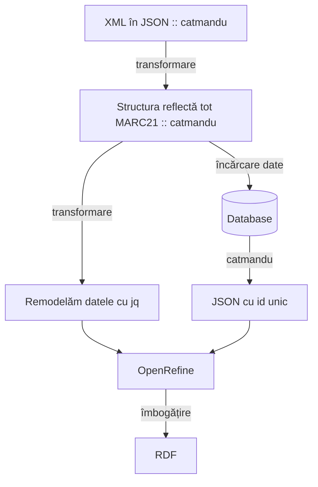
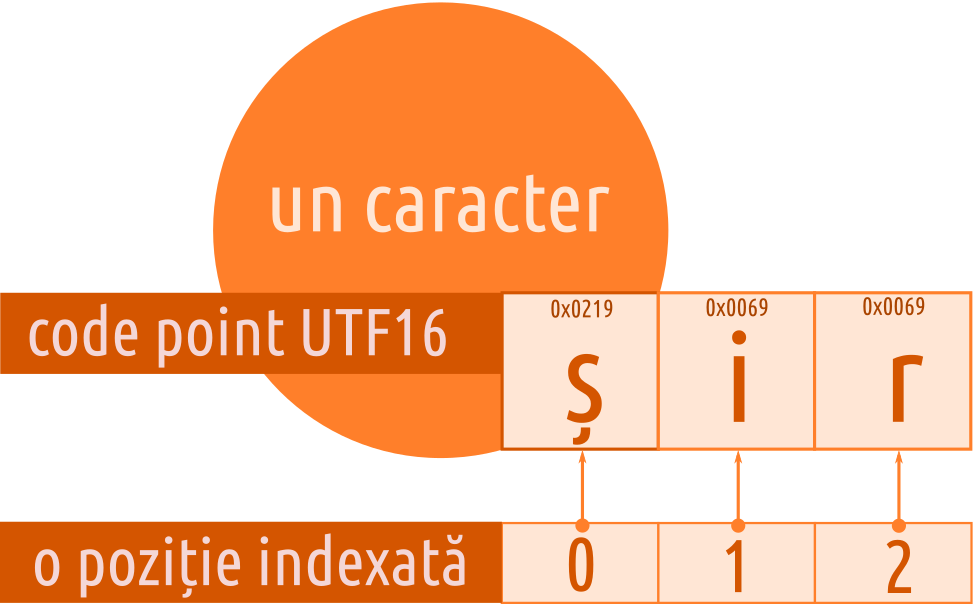

# Microexercițiu

## Ce vom realiza

Scopul acestui exercițiu este cel al trecerii printr-un flux de prelucrare cu scopul de a transforma datele în resurse mai bune, predispuse conectării cu alte seturi de date.



## Transformare date

Transformarea unui subset de trei înregistrări. Pentru transformare, vom folosi utilitarul `catmandu`. Să transformăm micro-setul nostru într-un format cu o verbozitate redusă (JSON).

```bash
sudo catmandu convert -v MARC --type XML to JSON < set.xml > set.json
[sudo] password for nicolaie: 
converted 3 items
done
```

Ceea ce am realizat este transformarea de la formatul XML în JSON. Adică, de la:

```xml
<?xml version="1.0" encoding="UTF-8"?>
<collection xmlns="http://www.loc.gov/MARC21/slim">
  <record>
    <leader>00000nam a2200000 a 4500</leader>
    <controlfield tag="008">210615s1805####|||||||||||||||||#||####u</controlfield>
    <datafield tag="050" ind1=" " ind2=" ">
      <subfield code="a">094.1(498); 811.135.1'36-112</subfield>
    </datafield>
    <datafield tag="100" ind1=" " ind2=" ">
      <subfield code="a">Şincai, Gheorghe</subfield>
    </datafield>
    <datafield tag="245" ind1="1" ind2="0">
      <subfield code="a">Elementa Linguae Daco - Romanae sive Valachicae emendata, facilitata, et in meliorem ordinem redacta per Georgium Sinkay de Eadem, AA. LL. Philosophiae, &amp; SS. Theologiae Doctorem, Scholarum Nationalium Valachicarum in Magno Transylvaniae Principatu primum, atque emeritum Directorem, nunc penes Regiam Universitatis Pestanae Typographiam Typi Correctorem. Budae, Typis Regiae Universitatis Pestanae. 1805.</subfield>
      <subfield code="c">Georgium Sinkai</subfield>
      <subfield code="h">[Carte tipărită]</subfield>
    </datafield>
    <datafield tag="260" ind1=" " ind2=" ">
      <subfield code="a">Buda</subfield>
      <subfield code="b">Typis Regiae Universitatis Pestanae</subfield>
      <subfield code="c">1805</subfield>
    </datafield>
    <datafield tag="300" ind1=" " ind2=" ">
      <subfield code="a">110 p. ; 19 cm</subfield>
    </datafield>
    <datafield tag="500" ind1=" " ind2=" ">
      <subfield code="a">Legătura: carton recent. Însemnări: p. 58: Papp Teodorovici Observații: pe pagina de titlu r: ștampilă cu textul „B. R. V.”; mic ornament tipografic pe partea superioară a paginii de titlu r; este colligat cu lucrarea: Gheorghe Șincai, Epistola, Buda, 1804.</subfield>
    </datafield>
    <datafield tag="650" ind1=" " ind2=" ">
      <subfield code="a">carte românească veche</subfield>
    </datafield>
    <datafield tag="650" ind1=" " ind2=" ">
      <subfield code="a">lingvistică</subfield>
    </datafield>
    <datafield tag="650" ind1=" " ind2=" ">
      <subfield code="a">limba română</subfield>
    </datafield>
    <datafield tag="650" ind1=" " ind2=" ">
      <subfield code="a">gramatică</subfield>
    </datafield>
    <datafield tag="650" ind1=" " ind2=" ">
      <subfield code="a">gramatică istorică</subfield>
    </datafield>
    <datafield tag="650" ind1=" " ind2=" ">
      <subfield code="a">morfologie</subfield>
    </datafield>
    <datafield tag="856" ind1=" " ind2=" ">
      <subfield code="u">http://www.dspace.bjastrasibiu.ro/bitstream/123456789/10673/1/BJA_CS_000101_BRV_0001-0118.pdf</subfield>
    </datafield>
    <datafield tag="995" ind1=" " ind2=" ">
      <subfield code="a">Colecţii Speciale - BRV</subfield>
      <subfield code="D">0.01</subfield>
      <subfield code="e">BRV101</subfield>
      <subfield code="F">Sediul_Central_A</subfield>
      <subfield code="j">687a BRV</subfield>
      <subfield code="U">Available</subfield>
      <subfield code="W">Jun 15, 2021</subfield>
      <subfield code="y">BRV101</subfield>
      <subfield code="Z">Împrumut la Sala</subfield>
    </datafield>
  </record>
</collection>
```

la 

```json
[{
  "_id": null,
  "record": [
    ["LDR", " ", " ", "_", "00000nam a2200000 a 4500"],
    ["008", " ", " ", "_", "210615s1805####|||||||||||||||||#||####u"],
    ["050", " ", " ", "a", "094.1(498); 811.135.1'36-112"],
    ["100", " ", " ", "a", "Şincai, Gheorghe"],
    ["245", "1", "0", "a", "Elementa Linguae Daco - Romanae sive Valachicae emendata, facilitata, et in meliorem ordinem redacta per Georgium Sinkay de Eadem, AA. LL. Philosophiae, & SS. Theologiae Doctorem, Scholarum Nationalium Valachicarum in Magno Transylvaniae Principatu primum, atque emeritum Directorem, nunc penes Regiam Universitatis Pestanae Typographiam Typi Correctorem. Budae, Typis Regiae Universitatis Pestanae. 1805.", "c", "Georgium Sinkai", "h", "[Carte tipărită]"],
    ["260", " ", " ", "a", "Buda", "b", "Typis Regiae Universitatis Pestanae", "c", "1805"],
    ["300", " ", " ", "a", "110 p. ; 19 cm"],
    ["500", " ", " ", "a", "Legătura: carton recent. Însemnări: p. 58: Papp Teodorovici Observații: pe pagina de titlu r: ștampilă cu textul „B. R. V.”; mic ornament tipografic pe partea superioară a paginii de titlu r; este colligat cu lucrarea: Gheorghe Șincai, Epistola, Buda, 1804."],
    ["650", " ", " ", "a", "carte românească veche"],
    ["650", " ", " ", "a", "lingvistică"],
    ["650", " ", " ", "a", "limba română"],
    ["650", " ", " ", "a", "gramatică"],
    ["650", " ", " ", "a", "gramatică istorică"],
    ["650", " ", " ", "a", "morfologie"],
    ["856", " ", " ", "u", "http://www.dspace.bjastrasibiu.ro/bitstream/123456789/10673/1/BJA_CS_000101_BRV_0001-0118.pdf"],
    ["995", " ", " ", "a", "Colecţii Speciale - BRV", "D", "0.01", "e", "BRV101", "F", "Sediul_Central_A", "j", "687a BRV", "U", "Available", "W", "Jun 15, 2021", "y", "BRV101", "Z", "Împrumut la Sala"]
  ]
}]
```

Din nefericire, această formă nu este îndeajuns. Este doar o simplă transformare de la un format la altul.

## Să devenim programatori la nivelul minim necesar

Deschideți browserul. Apăsați combinația CTRL+SHIFT+i sau urmați calea Meniu -> More tools -> Developer tools. Accesați tabul *Console*. Să creăm un spațiu în memoria computerului în care vom depozita date. Acest spațiu necesar poartă o denumire pe care să o folosim precum o adresă fizică. Tipul de spațiu pe care îl vom crea este un obiect. Adică o entitate căreia îi putem adăuga atribute. O entitate de tip obiect trebuie să poată fi exprimată folosind o *sintaxă*. În JavaScript, limbajul pe care îl vom folosi, este o pereche de acolade.

```javascript
let setdate = {};
```

Introdu fragmentul de cod în Console și dă Enter.

Să adăugăm o proprietate entității de tip obiect pe care am denumit-o `setdate`.

```javascript
setdate.titlu = 'Elementa Linguae Daco - Romanae sive Valachicae';
```

Introdu fragmentul de cod în Console și dă Enter.

Să verificăm ce s-a petrecut. Scriem numele obiectului și dăm Enter: `{titlu: "Elementa Linguae Daco - Romanae sive Valachicae"}`. Observați faptul că obiectul nostru a fost populat cu o nouă proprietate, adică un nou atribut al obiectului. Să mai adăugăm o proprietate.

```javascript
setdate.autor = 'Şincai, Gheorghe';
```

Introdu fragmentul de cod în Console și dă Enter. Pentru a inspecta obiectul, vom scrie numele său, și dăm Enter.

Obiectul nostru arată astfel acum: `{titlu: "Elementa Linguae Daco - Romanae sive Valachicae", autor: "Şincai, Gheorghe"}`.

Să introducem o proprietate nouă: `setdate.test = 10`. Observă faptul că am introdus o valoare numerică. Să inspectăm obiectul acum apelând din nou numele obiectului. Acum să o ștergem: `delete setdate.test;`. Să inspectăm obiectul. Proprietatea `test` a dispărut.

După cum am observat, putem adăuga valori unor proprietăți ale unui obiect. Valorile cu care vom lucra în construcția obiectelor noastre le vom restrânge la cele permise de JSON - JavaScript Object Notation (https://www.json.org/json-en.html). Privind la coloana din dreapta a site-ului dedicat standardului, la mențiunea `values`sunt înșiruite tipurile de date pe care le putem atribui drept valori unei proprietăți a unui obiect.

Poți construi obiecte cu toate proprietățile lor, declarându-le direct, deodată: `let record = {a: 1, b: 'ceva', c: {z: true}, d: [1, 2]};`.

Două se disting și sunt necesare pentru a merge mai departe. Primul este legat de faptul că un obiect poate fi la rândul său valoare a unei proprietăți. Al doilea este un **array**. 

Un array este o listă de lucruri. De fapt, este la rândul său un obiect, care are structura și comportamentul unui obiect. Cu o singură diferență notabilă: elementele listei sunt indexate numeric.



Să ne întoarcem la Console. Să creăm o altă locație în memorie numită `cuvânt`: `let cuvânt = 'undeva';`. Limbajul de programare ne permite să investigăm obiectele prin mici progrămele (vezi https://github.com/kosson/javascript-invat-eu-inveti-si-tu/tree/master/obiecte/obiecte-interne-standard/Array/prototype-array) care sunt disponibile deja. Să numărâm câte litere sunt: `cuvânt.length`. Spuneam că array-urile sunt indexate numeric. Atenție, numărătoarea pornește de la 0, nu de la 1. Pentru a accesa valoarea de la un anumit index, vom extrage valoarea folosind următoarea sintaxă: `cuvânt[0]`. Care este caracterul returnat?

Mergem mai departe. Am văzut cum un singur cuvânt, care este un șir de caractere poate fi explorat accesând indexul. Am putea spune că un array este o listă indexată. Să reținem termenul de listă și să construim o colecție de termeni: `let colecție = ['carte românească veche', 'lingvistică', 'limba română', 'gramatică', 'gramatică istorică', 'morfologie'];`. Investigați care este valoarea de la indexul 1. Rezolvare: `colecție[1]`.

Array-urile pot conține la rândul lor obiecte și alte array-uri: `let varietate = ['ceva', {a: 1}, ['a', 'b']]`. Să adăugăm colecția ca proprietate a obiectului pe care l-am creat deja: `setdate.subject = colecție`. Pentru a vedea frumos tot obiectul afișat, vom apela o funcție care are rolul de a ne dezvălui obiectul în toată splendoarea sa: `console.dir(setdate)`.

Pentru a obține datele în format JSON, vom transforma obiectul, care acum este un obiect JavaScript într-unul care este *serializat*, adică este pregătit pentru a fi utilizat în transferurile de date. Pentru a-l transforma în JSON, vom avea nevoie să creăm alt spațiu în memorie, adică un alt identificator: `let setjson = JSON.stringify(setdate, null, 2);`. Observă faptul că folosim o secvență de cod care prelucrează obiectul nostru: `JSON.stringify(setdate, null, 2)`. Avem obiectul `JSON` pe care îl pune la dispoziție mediul de programare din oficiu, de la care folosim o proprietate care este un mic progrămel numit `stringify` ce prelucrează datele din obiectul creat de noi `setdate`.

Hai să vedem ce-am obținut: `console.dir(setjson);`. Parcă este rezultatul la care dorim să ajungem, adică o înregistrare care respectă câmpurile Dublin Core codată în formatul [JSON](https://www.json.org/json-en.html).

## De la MARC21, la Dublin Core

Acum, vom schimba formatul de metadate, trecând de la MARC21, la DublinCore. Vom apela din nou la `catmandu`. Înainte de a porni să facem conversia, va trebui să facem o *hartă* (în jargonul IT s-a cimentat o versiune calchiată: *mapare*) de corespondențe pentru a transfera datele unui câmp din MARC21 la câmpul corespondent al altui format (Dublin Core). Va trebui creat un fișier numit arbitrar `modelare.fix`. Fișierul acesta este un set de reguli pe care programul `catmandu` le parcurge linie cu linie și le aplică fiecărei înregistrări. Acesta este un fișier care poate fi deschis cu un editor simplu de text. Conținutul *hărții* este următorul:

```text
marc_map(245,title, -join => " ")
marc_map(100,creator.$append)
marc_map(700,creator.$append)
marc_map(020a,isbn.$append)
marc_map(022a,issn.$append)
replace_all(isbn.," .","")
replace_all(issn.," .","")
marc_map(050a,identifier)
marc_map(260b,publisher)
replace_all(publisher,",$","")
marc_map(260c,date)
replace_all(date,"\D+","")
marc_map(300a,format)
marc_map(650a,subject.$append)
marc_map(500a,description.$append)
marc_map(001,description.$append)
marc_map(995,description, -join => " ")
remove_field('record');
```

Având fișierul de *mapare* putem să facem transformarea dorită. Într-un sistem de operare Linux/GNU avem la dispoziție Terminalul cu ajutorul căruia executăm comanda.

```bash
sudo catmandu convert -v MARC --fix modelare.fix --type XML to JSON < set.xml > dublincore.json
[sudo] password for nicolaie: 
converted 3 items
done
```

Avem următoarea formă mai clară.

```json
[{
  "description": "Colecţii Speciale - BRV BRV101 687a BRV BRV101",
  "publisher": "Typis Regiae Universitatis Pestanae",
  "identifier": "094.1(498); 811.135.1'36-112",
  "subject": ["carte românească veche", "lingvistică", "limba română", "gramatică", "gramatică istorică", "morfologie"],
  "_id": null,
  "date": "1805",
  "format": "110 p. ; 19 cm",
  "creator": ["Şincai, Gheorghe"],
  "title": "Elementa Linguae Daco - Romanae sive Valachicae emendata, facilitata, et in meliorem ordinem redacta per Georgium Sinkay de Eadem, AA. LL. Philosophiae, & SS. Theologiae Doctorem, Scholarum Nationalium Valachicarum in Magno Transylvaniae Principatu primum, atque emeritum Directorem, nunc penes Regiam Universitatis Pestanae Typographiam Typi Correctorem. Budae, Typis Regiae Universitatis Pestanae. 1805. Georgium Sinkai [Carte tipărită]"
}]
```

Iregularități în date pe care am dori să le exploatăm pentru a face un plan de bătaie pentru îndreptare:

- câmpul `subject` este un *array*. Nevoia ar fi să transformăm array-ul într-un șir de caractere în care fostele elemente sunt parte a șirului de caractere, dar care sunt separate de celelalte prin virgulă, de exemplu. Virgulele se numesc separatori.
- La fel avem și cazul câmpului `creator`.

## Remodelare cu jq

Pentru a elimina iregularitățile pe care deja le-am depistat, vom remodela micul nostru set de date folosind un utilitar extraordinar numit *jq*. Comanda de jos este utilă pentru sistemul de operare Linux/GNU Ubuntu 20.04.

```bash
cat dublincore.json | jq '
map(. +
{
  id: (if ._id == null then "" else ._id end),
  creator: (if has("creator") then .creator | join(", ") else .creator // "" end),
  subject: (if has("subject") then .subject | join(", ") else .subject // "" end),
  title,
  publisher: (if .publisher == null then "" else .publisher end),
  identifier: (if .identifier == null then "" else .identifier end),
  date, format,
  description: (if .description == null then "" else .description end),
} | del(._id))' > 'dcreformated.json'
```

Ceea ce vom obține este un nou fișier pe care l-am denumit arbitrar `dcreformated.json`. O înregistrare remodelată va arăta astfel:

```json
  {
    "description": "Colecţii Speciale - BRV BRV101 687a BRV BRV101",
    "publisher": "Typis Regiae Universitatis Pestanae",
    "identifier": "094.1(498); 811.135.1'36-112",
    "subject": "carte românească veche, lingvistică, limba română, gramatică, gramatică istorică, morfologie",
    "date": "1805",
    "format": "110 p. ; 19 cm",
    "creator": "Şincai, Gheorghe",
    "title": "Elementa Linguae Daco - Romanae sive Valachicae emendata, facilitata, et in meliorem ordinem redacta per Georgium Sinkay de Eadem, AA. LL. Philosophiae, & SS. Theologiae Doctorem, Scholarum Nationalium Valachicarum in Magno Transylvaniae Principatu primum, atque emeritum Directorem, nunc penes Regiam Universitatis Pestanae Typographiam Typi Correctorem. Budae, Typis Regiae Universitatis Pestanae. 1805. Georgium Sinkai [Carte tipărită]",
    "id": ""
  }
```

## Introducerea datelor în MongoDB

Aceasta este o fază care încheie cercul unui exercițiu Extract, Transform, Load (ETL). Pentru a introduce datele în MongoDB, vom apela tot la utilitarul `catmandu`.

```bash
catmandu import -v JSON --multiline 1 to MongoDB --database_name catalogcolectiv --bag carti < dcreformated.json
```

Dacă am exporta datele din MongoDB, am obține o nouă colecție în format JSON, dar spre deosebire de setul care a intrat, aceasta a pus un identificator unic fiecărei înregistrări.

```json
{
  "subject": "carte românească veche, lingvistică, limba română, gramatică, gramatică istorică, morfologie",
  "creator": "Şincai, Gheorghe",
  "publisher": "Typis Regiae Universitatis Pestanae",
  "identifier": "094.1(498); 811.135.1'36-112",
  "id": "",
  "_id": "a7825212-03cb-11ec-a2b1-e2641e40cc0b",
  "format": "110 p. ; 19 cm",
  "title": "Elementa Linguae Daco - Romanae sive Valachicae emendata, facilitata, et in meliorem ordinem redacta per Georgium Sinkay de Eadem, AA. LL. Philosophiae, & SS. Theologiae Doctorem, Scholarum Nationalium Valachicarum in Magno Transylvaniae Principatu primum, atque emeritum Directorem, nunc penes Regiam Universitatis Pestanae Typographiam Typi Correctorem. Budae, Typis Regiae Universitatis Pestanae. 1805. Georgium Sinkai [Carte tipărită]",
  "date": "1805",
  "description": "Colecţii Speciale - BRV BRV101 687a BRV BRV101"
}
```


## Resurse

- Cum am creat graficele în Markdown: https://mermaid-js.github.io/mermaid/#/flowchart
- Redactare grafice online: https://mermaid-js.github.io/mermaid-live-editor
- [Sursa schemei mermaid](https://mermaid-js.github.io/mermaid-live-editor/edit#eyJjb2RlIjoiZ3JhcGggVEQ7XG4gICAgICAgIE1BUkMyMVtYTUwgw65uIEpTT04gOjogY2F0bWFuZHVdIC0tdHJhbnNmb3JtYXJlLS0-IEpTT05bU3RydWN0dXJhIHJlZmxlY3TEgyB0b3QgTUFSQzIxIDo6IGNhdG1hbmR1XTtcbiAgICAgICAgSlNPTiAtLXRyYW5zZm9ybWFyZS0tPiBKUVtSZW1vZGVsxINtIGRhdGVsZSBjdSBqcV07XG4gICAgICAgIEpTT04gLS3Drm5jxINyY2FyZSBkYXRlLS0-IE1vbmdvREJbKERhdGFiYXNlKV07XG4gICAgICAgIE1vbmdvREIgLS1jYXRtYW5kdS0tPiBKU09OMVtKU09OIGN1IGlkIHVuaWNdO1xuICAgICAgICBKUSAtLT4gT3BlblJlZmluZTtcbiAgICAgICAgSlNPTjEgLS0-IE9wZW5SZWZpbmU7XG4gICAgICAgIE9wZW5SZWZpbmUgLS3Drm1ib2fEg8ibaXJlLS0-IFJERjtcbiAgICAiLCJtZXJtYWlkIjoie1xuICBcInRoZW1lXCI6IFwiZGVmYXVsdFwiXG59IiwidXBkYXRlRWRpdG9yIjpmYWxzZSwiYXV0b1N5bmMiOnRydWUsInVwZGF0ZURpYWdyYW0iOmZhbHNlfQ)

